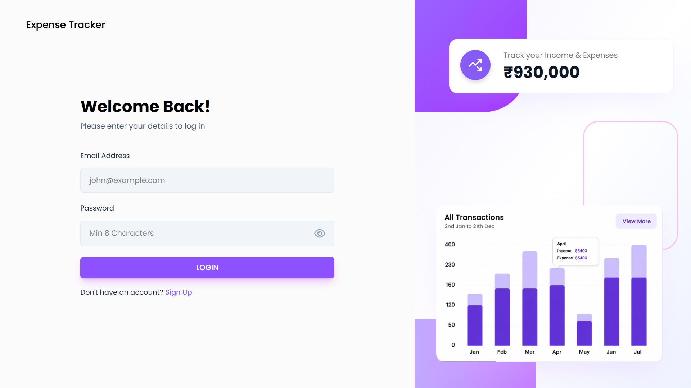
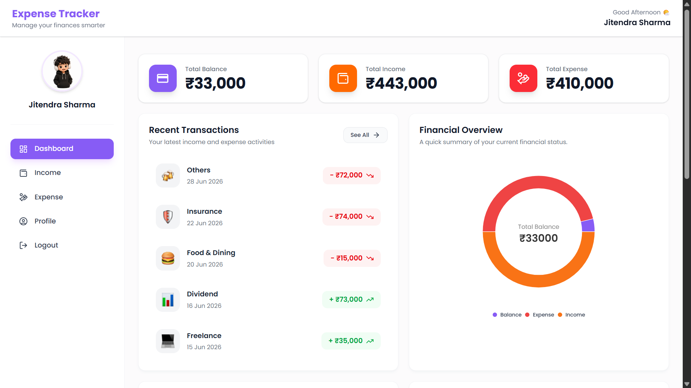
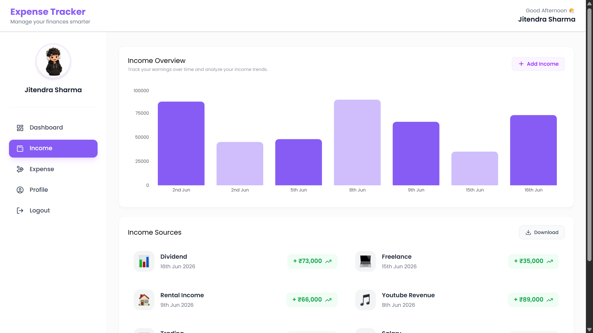
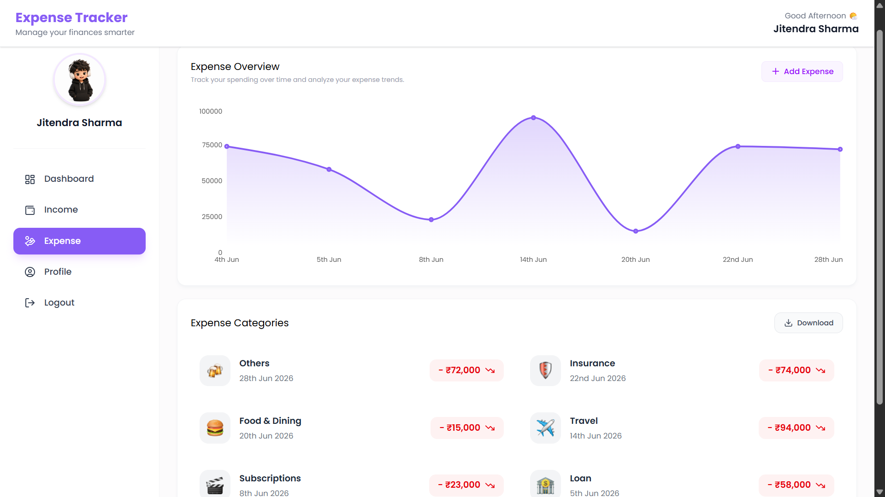
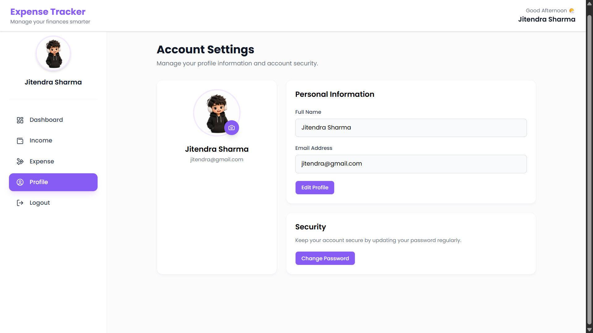

# 💰 Expense Tracker

A modern full-stack **Expense Tracker** built using the **MERN Stack** that helps users efficiently manage their personal finances by tracking income and expenses, visualizing financial data through interactive charts, and exporting reports.

---

## 🚀 Live Demo

> Coming Soon

---

## 📸 Screenshots

> Add screenshots here after deployment.

### Login



### Dashboard



### Income



### Expense



### Profile



---

# ✨ Features

## 🔐 Authentication

- User Registration
- Secure Login
- JWT Authentication
- Protected Routes
- Persistent Login using JWT

---

## 📊 Dashboard

- Total Balance Overview
- Total Income
- Total Expenses
- Recent Transactions
- Financial Summary
- Income Analytics
- Expense Analytics

---

## 💵 Income Management

- Add Income
- Delete Income
- Income Overview
- Income History
- Export Income Report to Excel

---

## 💸 Expense Management

- Add Expense
- Delete Expense
- Expense Overview
- Expense History
- Export Expense Report to Excel

---

## 📈 Analytics

- Interactive Pie Charts
- Interactive Bar Charts
- Financial Overview
- Income Trend Visualization
- Expense Tracking

---

## 👤 User Profile

- View Profile
- Update Full Name
- Upload Profile Picture
- Change Password
- Instant UI Updates

---

## 🎨 UI Features

- Responsive Design
- Modern Dashboard
- Interactive Cards
- Toast Notifications
- Beautiful Charts
- Clean User Interface

---

# 🛠 Tech Stack

## Frontend

- React.js
- Vite
- Tailwind CSS
- React Router DOM
- Axios
- React Hot Toast
- Recharts
- React Icons
- Moment.js

---

## Backend

- Node.js
- Express.js
- MongoDB
- Mongoose
- JWT Authentication
- Multer
- bcryptjs
- dotenv

---

# 📂 Folder Structure

```
Expense-Tracker
│
├── Backend
│   ├── controllers
│   ├── middleware
│   ├── models
│   ├── routes
│   ├── uploads
│   ├── utils
│   ├── app.js
│   └── package.json
│
└── Frontend
    ├── src
    │   ├── assets
    │   ├── components
    │   ├── context
    │   ├── pages
    │   ├── utils
    │   ├── App.jsx
    │   └── main.jsx
    │
    └── package.json
```

---

# ⚙ Installation

## Clone Repository

```bash
git clone https://github.com/YOUR_USERNAME/Expense-Tracker.git
```

```
cd Expense-Tracker
```

---

## Backend Setup

```
cd Backend
```

Install dependencies

```bash
npm install
```

Create a `.env` file

```env
PORT=8000

MONGO_URI=YOUR_MONGODB_URI

JWT_SECRET=YOUR_SECRET_KEY
```

Run Backend

```bash
npm run dev
```

---

## Frontend Setup

```
cd Frontend
```

Install dependencies

```bash
npm install
```

Run Frontend

```bash
npm run dev
```

---

# 📊 Main Functionalities

- Authentication using JWT
- Secure Password Encryption
- Income CRUD Operations
- Expense CRUD Operations
- Dashboard Analytics
- Interactive Charts
- Profile Management
- Password Update
- Image Upload
- Excel Export
- Responsive UI

---

# 📦 Dependencies

### Frontend

```
react
vite
tailwindcss
axios
react-router-dom
react-hot-toast
recharts
moment
react-icons
```

### Backend

```
express
mongoose
jsonwebtoken
bcryptjs
multer
cors
dotenv
xlsx
```

---

# 🎯 Future Improvements

- Search Transactions
- Filter by Date
- Sorting
- Pagination
- Budget Planning
- Monthly Reports
- Dark Mode
- Email Notifications
- Multi-Currency Support
- Recurring Transactions

---

# 📚 What I Learned

Through this project I gained hands-on experience with:

- Building Full Stack MERN Applications
- REST API Development
- JWT Authentication
- MongoDB Database Design
- Image Upload using Multer
- React Context API
- State Management
- Protected Routing
- Data Visualization using Recharts
- Excel Report Generation
- Responsive UI Design with Tailwind CSS
- Git & GitHub Workflow

---

# 👨‍💻 Author

**Jitendra Sharma**

GitHub:
https://github.com/Jitendra1606

LinkedIn:

---

# ⭐ Support

If you like this project, consider giving it a ⭐ on GitHub.

It motivates me to build more projects.

---

## 📄 License

This project is created for learning purposes and personal portfolio.
